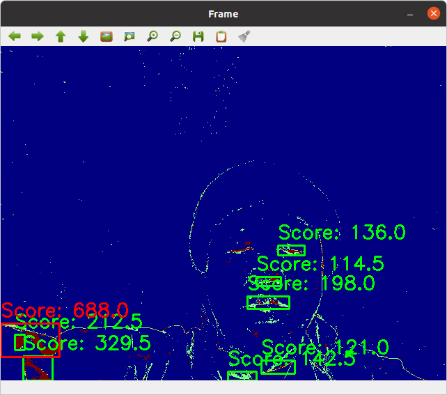
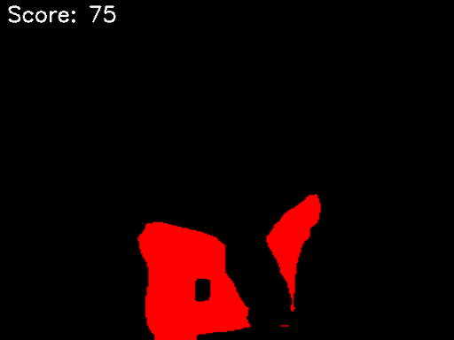

# Power score
- check your motion value
- It may not be correct

```
python powermeter.py
```





# aura-count
- Counting your aura
- But It is fun script to let kids interesting.


```
python aura-count.py
```



# Scouter fun
- It is not real scouter but It is for us to fun to know your fighting capability.
- Its original idea is from famouse Japanese magagine as you know!
  
