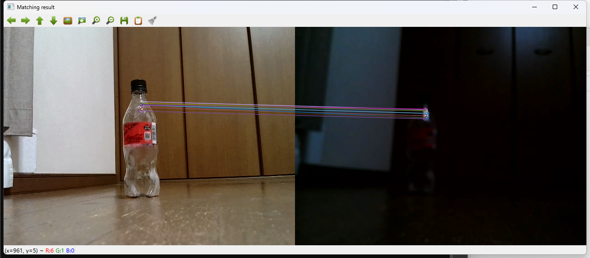

# Utilities
-This is stock directory for my troubleshooting used scripts and so on.

## face_clean.ipynb
- try 2 single camera to use as stero cam
- just realized positioning. Oh my!
- As you know from example, using same camera setup is more effective.
- right camera Auto EV function does not work well.

## soundtest.py
- Check sound setting simple test.
- It was used to resolve ubuntu sound problem.
