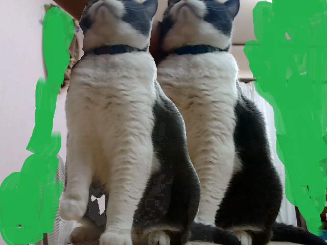
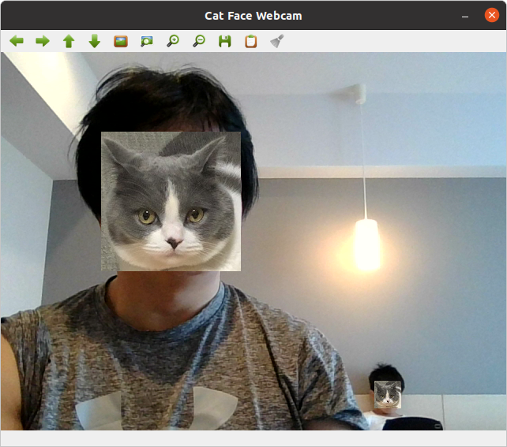

# MEOW MEOW COPY
## For everybody who love cat!
- But It is really simple tool
- I prepare Jupyter notebook ver and terminal command version.

### terminal version command 

```

python meowmeow_copy.py

```

### jupyter version
- execute copyMEOWMEOW.ipynb only.




## control
- A : add cat
- B : reduce cat

## equipment
webcam is needed.

```
# required modules
pytorch
torchvision
Pillow
opencv
numpy 

```

# Meow face generator
finding person, your/ thier face change your favorite cat

```

python face_cat.py

```
## change face image
- If you want to change image, you can change this line.
```
# 猫の顔画像を読み込み*(image directory)
cat_face_img = cv2.imread('data/fuku.jpg')

```




