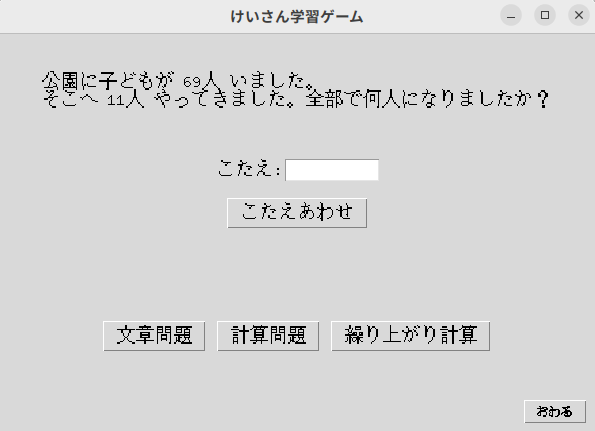

# けいさん学習ゲーム (Calculation Learning Game)
- PythonとTkinterで作られた、子どものためのシンプルで楽しい計算学習ゲームです。文章問題、単純な計算、繰り上がり・繰り下がり計算など、様々な形式の問題に挑戦できます。
- A simple and fun calculation learning game for children, built with Python and Tkinter. It allows children to challenge various types of problems, including word problems, simple calculations, and calculations with carrying and borrowing.

## 🇯🇵 日本語
## 主な機能

## 多彩な問題形式:
1. 文章問題: 登場人物やアイテムがランダムに変わり、無限のバリエーションが楽しめます。
2. 計算問題: シンプルな四則演算（現在は足し算・引き算）の練習ができます。
3. 繰り上がり・繰り下がり計算: 苦手な部分を重点的に特訓できるよう、必ず繰り上がり・繰り下がりが発生する問題を生成します。
4. 難易度調整: ゲーム開始時に「かんたん(1桁)」「ふつう(2桁)」「むずかしい(3桁)」からレベルを選択でき、子どもの習熟度に合わせた学習が可能です。
5. 問題のカスタマイズ: problems.json ファイルを編集するだけで、プログラミングの知識がなくても新しい文章問題のテンプレートや単語を簡単に追加できます。
6. 多言語対応: UIや問題文は日本語と英語に対応しています。（コード内の current_lang 変数で切り替え）

# 動作環境
Python 3.x
- 特別なライブラリは不要です。Pythonの標準機能のみで動作します。

## 実行方法
- このリポジトリをクローンまたはダウンロードします。
- main.py (プログラム本体) と problems.json (問題データ) が同じフォルダにあることを確認します。
- ターミナル（コマンドプロンプト）で以下のコマンドを実行します。
'''
python main.py
'''

最初に「難易度選択」画面が表示されるので、レベルを選んでください。
ゲーム画面が表示されたら、画面下のボタンで出題したい問題の種類を選んで学習を始めましょう！
# 問題の追加とカスタマイズ
- 文章問題のバリエーションは problems.json ファイルを編集することで自由に増やせます。
  - people: 登場人物の名前リスト
  - items: モノの名前リスト
  -templates: 問題文のテンプレート。 {num1}, {person} などのプレースホルダーが、プログラムによってランダムな数値や単語に置き換えられます。

# Features
## Multiple Problem Types:
## Word Problems: Enjoy endless variations with randomly assigned characters and items.
### Simple Calculations: Practice basic arithmetic operations (currently addition and subtraction).
- Calculations with Carry/Borrow: Generates problems that specifically require carrying or borrowing, perfect for targeted practice.
- Adjustable Difficulty: Select from three levels at the start: "Easy (1-digit)," "Normal (2-digit)," and "Hard (3-digit)," tailoring the challenge to the child's skill level.
- Easy to Customize: You can easily add new word problem templates and words by simply editing the problems.json file—no programming knowledge required.
- Bilingual Support: The user interface and problems support both Japanese and English (can be switched via the current_lang variable in the code).
## Requirements
- Python 3.x

