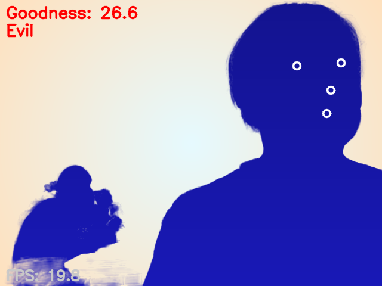
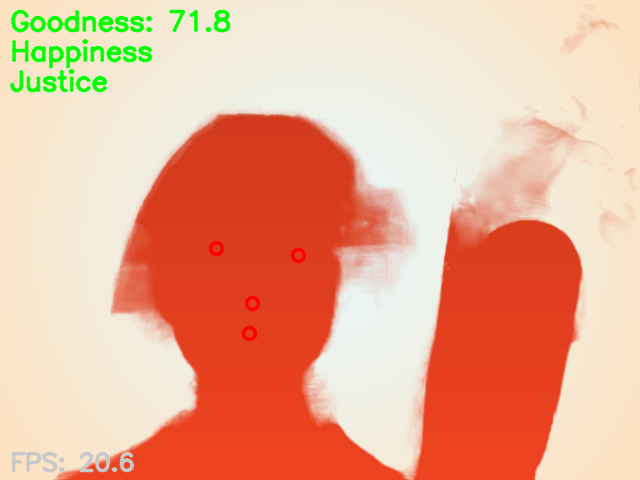

# FacePlay — Real-time “Good/Evil” Overlay with Face Blendshapes + Video Matting

- A tiny demo that segments the person from the camera feed, paints a bright gradient background, and colors the person layer based on a “goodness” score (smile + eye openness). Uses MediaPipe Face Landmarker (Tasks API) for landmarks & blendshapes, and Robust Video Matting (RVM, TorchScript) for a clean alpha matte (with landmark convex-hull fallback). 
Google AI for Developers


# Demo

Insert two screenshots (or GIFs) here:





# Features

- Always-on GUI via OpenCV (cv2.imshow)
- Segment the person with RVM (TorchScript) → fallback to convex hull from landmarks
- Expressions via blendshapes (MediaPipe Face Landmarker, VIDEO mode)
- A simple “Good/Evil” decision using smile and eye-open blendshape scores, smoothed by EMA + hysteresis

# Color design

- Background: bright, high-key radial gradient
- Person: colored in HSV; brightness increases with the score (0–100)
- References: RVM repo & release (TorchScript), MediaPipe Face Landmarker (Tasks API). 

# How it works (short)

- Capture a frame from your camera (cv2.VideoCapture).

- Face Landmarker (Tasks API) runs in VIDEO mode with a microsecond timestamp (detect_for_video) to output 3D landmarks and blendshapes (e.g., mouthSmileLeft/Right, eyeBlinkLeft/Right). 
Google AI for Developers
- Score = 0.7 * smile + 0.3 * (1 - blink) → mapped to 0–100, then EMA + hysteresis to stabilize.
- Matting: try RVM TorchScript (rvm_mobilenetv3_fp32.torchscript); if unavailable, build an alpha matte from the landmarks’ convex hull. 
GitHub
- Composite: composite = alpha * person + (1 - alpha) * background (Porter–Duff source-over). 

# Requirements
- Python 3.8+
- PyTorch (CUDA if available)
- OpenCV (GUI build) – not the headless wheel
- MediaPipe ≥ 0.10 (Tasks API)

# Quick start
```
# (optional) create a clean conda env
conda create -n faceplay python=3.8 -y
conda activate faceplay

# install deps (examples)
pip install torch torchvision --extra-index-url https://download.pytorch.org/whl/cu124  # pick wheels for your CUDA
pip install opencv-python mediapipe numpy

# run
python faceplay.py --cam 0

```


- If you see Could not load the Qt platform plugin "xcb" on Linux, your desktop/Qt runtime is missing pieces; install the required Qt/xcb packages for your distro (common OpenCV GUI pitfall). 
