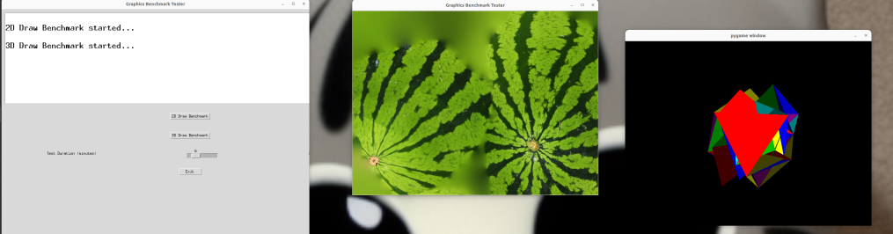

# gpu test pack for CUDA/cpu
- It is simple 2D/3D graphic checking
- If you have cuda, you can check status
- """ nvidia-smi   """

# Image and instruction
1. 2D/3D test button
2. test period slider(max 30 min)
3. exit button



# command line

```
python grapshtest.py

```
## requirement

```
pip install pygame  
pip install torch
pip install Pillow
pip install numpy
 
```
OpenGL, time , tkinter required.
