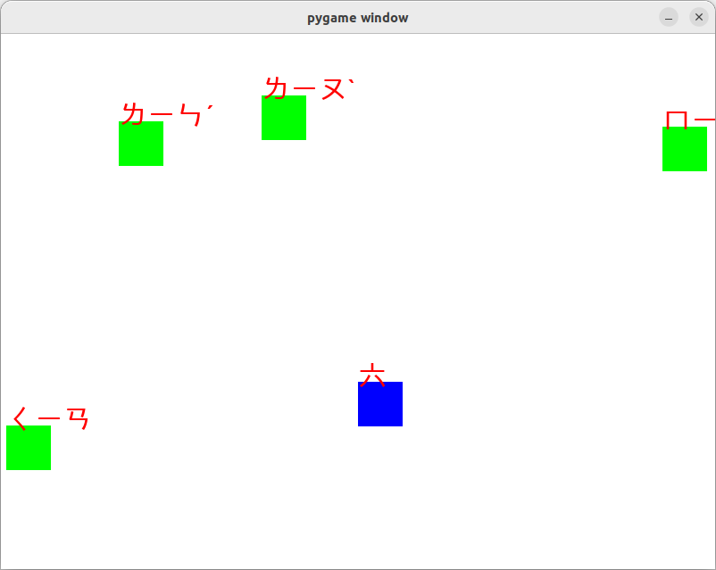

# Update
# ゲームタイプ
kanhan.py

```
python kanhan.py

```
- you can learn 3type kanji(hanzi)
- touch correct answer by control your character by arrow key
- 矢印キーで操作します。正解は加点・間違いは原点。120秒制限（デフォルト）
- You can extend hanzi.xlsx by yourself
- need download unicode font
- Unicode font is required. 
https://github.com/texttechnologylab/DHd2019BoA/blob/master/fonts/Arial%20Unicode%20MS.TTF




# 日中文（簡体字・繁体字）学習教材

- 学四则计算（＋ - ÷ ｘ）
- 学漢字汉字/拼音 漢字 注音、感じの読み
- 日本・中華圏を行きかうあなたのご子息の教育に。

## クイズタイプ
### 兒童計算.ipynb
### 漢字学習一年次.ipynb
- 10 question of hanzi
- 10この漢字の問題をランダムに
### 重新兒童計算.ipynb
- 計算Jupyter notebook版
