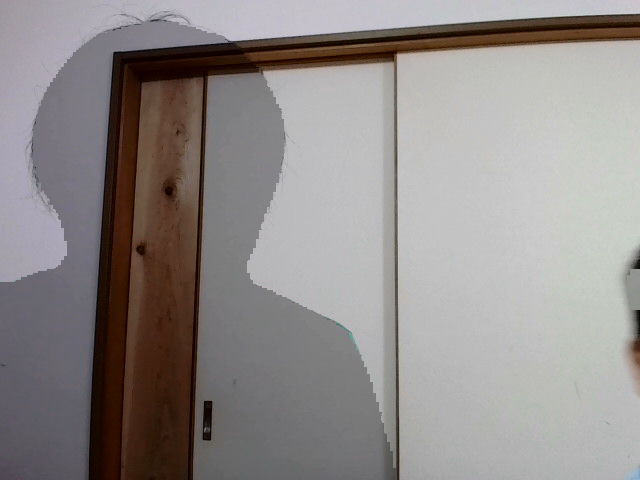

# iamge combine tool for kids request.

# New trans parent camera
- There is jupyter version and command line version


  
```
python transparent.py

```
**start this script within 5sec keep away from camera frame**
1. start script by the 5 sec keep away from camera frame (again)
2. after frame in you are transparent.

# scraping hobit image from google 
- but It should be used for pernal use.
- 個人使用に限定してください。
- こびとを合成するスクリプトです。
- 子供のリクエストなのでよくわかっていません。
