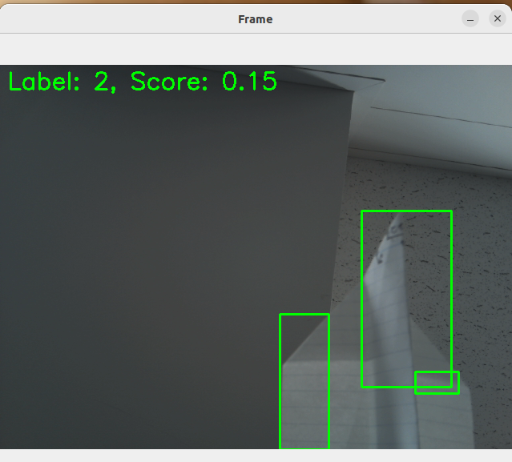

# pose_training.py
- Donce and kick pose recognize and show screen

```
python pose_training.py

```


# movingdetector
moving object detection tool

```
python ltmlab.py 

```

# requirement
- opencv-python
- numpy
- pytorch
- torchvision

# Detection image


