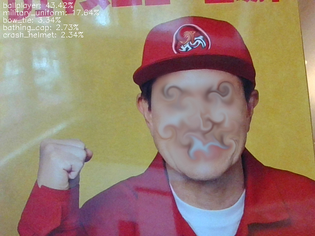

# Recognition pretrained sample named envanalyzer
## display percentage reconized object on the screen

- command line

```

python envanalyzer.py 

```
# sample image
- you can replace pretrained model or train by yourself, you can create your original script!


