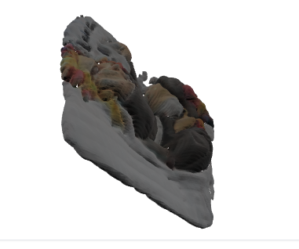

# 2D to 3D Model Generator (Local GUI)

A local, high-performance web-based GUI tool that converts single 2D images (JPG/PNG) into 3D mesh models (.glb).
This project utilizes TripoSR for 3D reconstruction and Rembg for automatic background removal. It is optimized for consumer GPUs (e.g., RTX 30xx/40xx series) with memory management features.

# 🚀 Features
- Single Image to 3D: Generates a 3D model from a single front-facing image.
- AI Inference: Automatically infers and reconstructs the back view of the object (no manual search required).
- GPU Acceleration:
  - Uses CUDA for 3D generation (TripoSR).
  - Uses CUDA for Background Removal (Rembg/ONNX Runtime) for high speed.

## VRAM Optimization:
  - Implements "Chunking" to prevent Out-Of-Memory (OOM) errors.
  - Auto-Fallback: Automatically lowers resolution (256 -> 128) if VRAM runs out during generation.
- Interactive GUI: Built with Gradio, allowing you to rotate and view the 3D model directly in the browser.
- Export: Saves results as standard .glb files (compatible with Windows 3D Viewer, Blender, Unity, Web).
# 🛠️ Prerequisites
- OS: Windows / Linux
- Python: 3.10 or later
- GPU: NVIDIA GPU with CUDA support (Recommended: 8GB+ VRAM).
- CUDA Toolkit: Installed and compatible with your PyTorch version.
# 📂 Directory Structure
- Ensure your project folder looks like this:

```
Text
Your-Project-Folder/
├── TripoSR/             # Cloned TripoSR repository
│   ├── tsr/
│   └── ...
├── app.py               # The main script (this tool)
└── requirements.txt     # (Optional)

```

# ⚙️ Installation
1. Clone the TripoSR Repository
First, you need the core TripoSR files.

```

git clone https://github.com/VAST-AI-Research/TripoSR.git
2. Install PyTorch (CUDA Version)
Visit PyTorch.org to get the correct command for your system.
Example for CUDA 11.8:

```
```

pip install torch torchvision torchaudio --index-url https://download.pytorch.org/whl/cu118

```

3. Install Dependencies
- Install the required Python libraries.


```
pip install gradio rembg trimesh numpy PIL transformers omegaconf einops

```

4. Enable GPU for Background Removal
- To make background removal fast, you must use onnxruntime-gpu.

```

# If standard onnxruntime is installed, remove it first
pip uninstall onnxruntime -y

# Install GPU version
pip install onnxruntime-gpu

```

# 🚀 Usage
- Open your terminal in the project folder.
Run the script:

```

python app.py

```




- (Note: Replace app.py with whatever you named the script, e.g., app_en.py)
  - Wait for the model weights to download (First run only).
- A local URL will appear (e.g., http://127.0.0.1:7860). Open it in your browser.
## Steps in GUI:
- Upload an image (Images with good lighting and clear shapes work best).
- Ensure "Auto Remove Background" is checked.
- Click "Generate 3D Model".
- Download the resulting .glb file or view it in the window.

# 🔧 Troubleshooting
- ModuleNotFoundError: No module named 'tsr'
- Make sure the TripoSR folder is in the same directory as your script.
- The script attempts to automatically add TripoSR to the system path, but the folder name must match exactly.

## CUDA out of memory
- The script has a built-in fallback mechanism. If it fails at resolution 256, it will automatically try 128.
If it still fails, open the script and lower the chunk_size inside the configuration section:

```

Python
model.renderer.chunk_size = 4096  # Try lowering to 2048
Background Removal is Slow
Check if onnxruntime-gpu is installed.
If you see [W:onnxruntime] GPU device discovery failed, the tool is falling back to CPU. Ensure your CUDA drivers are up to date.

```
# 📜 License
- This wrapper tool is open source.
- TripoSR is released under the MIT License by Stability AI & Tripo AI.
- Please refer to the TripoSR Repository for specific model usage terms.
