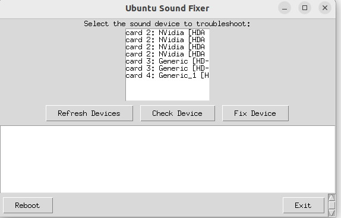

# sound utility for Linux(Ubuntu)
- check sound devices by GUI menu
- simply check and fix tool
- It is not help to re-install device driver

# command line

```Ubuntu
python sound_repair.py

```


# menu
- sample


</img>

