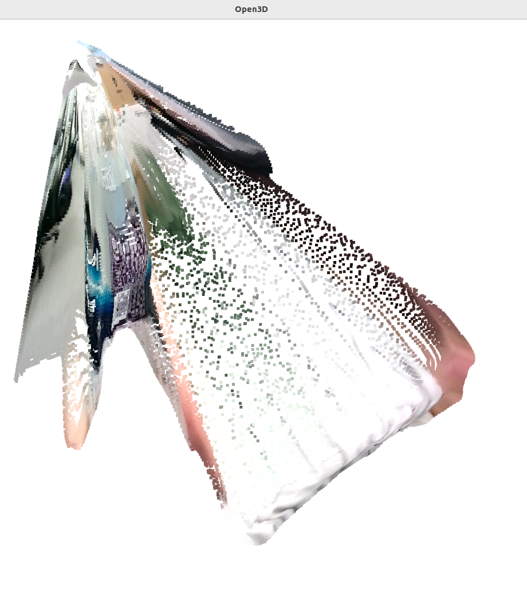

# toy3d
## It create 3D model by OPEN3D

## Prerequisites

- Python 3.x
- OpenCV
- PyTorch
- Open3D


# How to use
1. 2 cameras (1 front 2 side)
- That's all!
- side camera is set beside 15-20 digree angle from front camera

2. Calibration
- calibration for shooting 3d image with Chess board image

```
python calibrate.py

```
- after saved calibrated images and result.

3. capture 2 cameras image at the same time
- Step 2: Generate Depth Maps (Using MiDaS)


```

python mi_depth.py

```


```
python stereo_capture.py

```

4. Create 3D image with OPEN3D

```
python smerge_pointclouds.py

```

## Clear Intermediate Files

```
python all_clear.py

```
 
# Image sample



> [!NOTE]
> Generated 3D image file with "ply" file
> Image is available rotating as you like

# Directory

```

3dcamm/
├── merge_pointclouds_gpu.py（今回のスクリプト）
└── stereo/
    ├── front/
    ├── side/
    ├── depth_maps/
    └── pointclouds/
        ├── pointcloud_0.ply
        ├── pointcloud_1.ply
        └── ...
```
